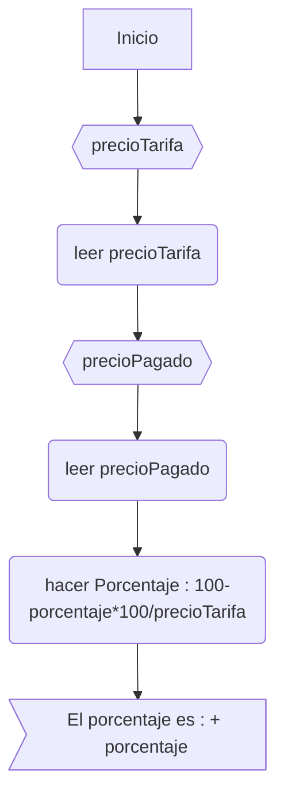

Git-tag1

```mermaid
graph TD;
Inicio-->id1{{precioTarifa}}
id1--> id2(leer precioTarifa)
id2 --> id3{{precioPagado}}
id3--> id4(leer precioPagado)
id4--> id5(hacer Porcentaje : 100-porcentaje*100/precioTarifa)
id5-->id6>"El porcentaje es :" + porcentaje]

    

```

